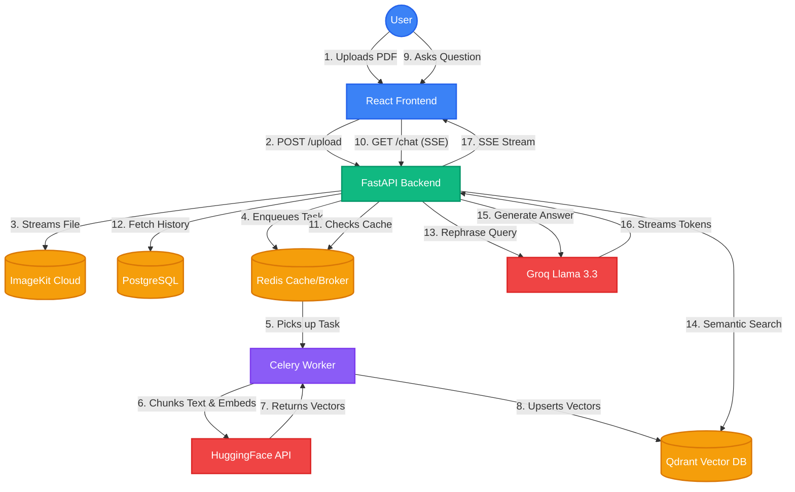

# DocMind 🧠

> **Executive Summary:** DocMind is an enterprise-grade, full-stack Retrieval-Augmented Generation (RAG) platform. It allows users to upload massive PDF documents and interactively query them. By leveraging asynchronous background task queues, vector databases, and semantic caching, the architecture ensures blazing-fast, accurate, and cost-effective AI inference.

---

## 🚀 Key Features
- **Asynchronous PDF Processing**: Heavy PDF parsing and vector embeddings are offloaded to a Celery worker queue, preventing web server bottlenecks.
- **Serverless Cloud Storage**: PDFs are securely uploaded and stored in ImageKit, allowing stateless worker nodes to access documents from anywhere.
- **Semantic Caching**: Duplicate or highly similar user queries are intercepted via Redis, instantly returning cached responses to drastically reduce LLM API costs and latency.
- **Contextual Memory**: The RAG pipeline automatically analyzes chat history to inject conversational context and gracefully rephrase ambiguous user queries before performing vector searches.
- **Server-Sent Events (SSE)**: Answers stream back to the client token-by-token in real-time, providing a ChatGPT-like user experience.
- **Multi-Tenant Architecture**: Strict row-level security in PostgreSQL and user-scoped payload filtering in Qdrant ensures data privacy.
- **CI/CD Ready**: Fully equipped with GitHub Actions for automated `pytest` suites and `black`/`prettier` code formatting.

---

## 🛠️ Technology Stack

| Category | Technology |
|---|---|
| **Frontend Framework** | React (Vite), Glassmorphism UI |
| **Backend Framework** | FastAPI (Python) |
| **Database (Relational)** | PostgreSQL (SQLAlchemy ORM) |
| **Database (Vector)** | Qdrant Cloud |
| **Message Broker / Cache**| Redis |
| **Task Queue** | Celery |
| **Cloud Storage** | ImageKit |
| **LLM Inference** | Llama 3.3 (via Groq API) |
| **Embeddings** | HuggingFace Inference API (`all-MiniLM-L6-v2`) |

---

## 🏗️ Architecture Flow Diagram



---

## 🚧 Engineering Challenges & Solutions

Building a robust RAG application introduced several architectural bottlenecks that we iteratively solved:

### 1. The "Blocked Web Server" Problem
**Problem:** Initially, we parsed 100+ page PDFs directly inside FastAPI's event loop using `BackgroundTasks`. This caused catastrophic CPU blocking, preventing other users from interacting with the platform while a large document was being embedded.
**Solution:** We migrated to a dedicated **Celery + Redis task queue architecture**. The web server now immediately returns a `201 Created` status, while the heavy lifting (chunking, embedding, vector upsertion) happens completely asynchronously in isolated worker processes.

### 2. Stateless Document Access
**Problem:** When we introduced Celery, the worker process couldn't reliably access the PDF file stored on the FastAPI container's local disk, especially when preparing for multi-node cloud deployments.
**Solution:** We integrated **ImageKit** as our cloud storage provider. FastAPI uploads the PDF stream directly to ImageKit and saves the URL to PostgreSQL. The Celery worker then downloads the PDF from the cloud, ensuring stateless, horizontally scalable infrastructure. 

### 3. High LLM Latency and Costs
**Problem:** Users repeatedly asking the same or highly similar questions on the same document caused redundant, expensive calls to the Groq LLM and HuggingFace Embedding API.
**Solution:** We implemented a **Semantic Caching Layer using Redis**. Before engaging the LLM, the system checks Redis for exact query matches on the specific document ID. If found, the system instantly streams the cached answer, saving API credits and dropping response times from seconds to milliseconds.

### 4. Windows Celery Compatibility
**Problem:** During local development on Windows, Celery's default `billiard` (prefork) multiprocessing library threw fatal `PermissionError: Access is denied` exceptions when trying to spawn worker nodes.
**Solution:** We engineered a custom Python process manager (`start.py`) that intelligently detects the host operating system (`os.name == 'nt'`). If running on Windows locally, it forces the Celery worker to boot using `--pool=solo`, bypassing the multiprocessing bug while preserving high-performance preforking for Linux production deployments.

---

## 📦 Local Development Setup

Recruiters and developers can instantly boot the entire architecture using Docker.

### 1. Clone the repository
```bash
git clone https://github.com/divyanshmehta355/docmind.git
cd docmind
```

### 2. Environment Variables
Create a `.env` file in the `backend` directory.
```bash
cd backend
cp .env.example .env
```
Fill in your API keys for:
- `GROQ_API_KEY`
- `QDRANT_API_KEY` & `QDRANT_URL`
- `HUGGINGFACE_API_KEY`
- `IMAGEKIT_PUBLIC_KEY` & `IMAGEKIT_PRIVATE_KEY`

### 3. Spin up the Stack (Docker)
Ensure Docker is running, then execute from the root directory:
```bash
docker-compose up --build
```
This single command spins up PostgreSQL, Redis, the FastAPI web server, the Celery background worker, and the Vite frontend.

- **Frontend:** http://localhost:5173
- **Backend API:** http://localhost:8000
- **Swagger Docs:** http://localhost:8000/docs

---
*Built with ❤️ by Divyansh.*
